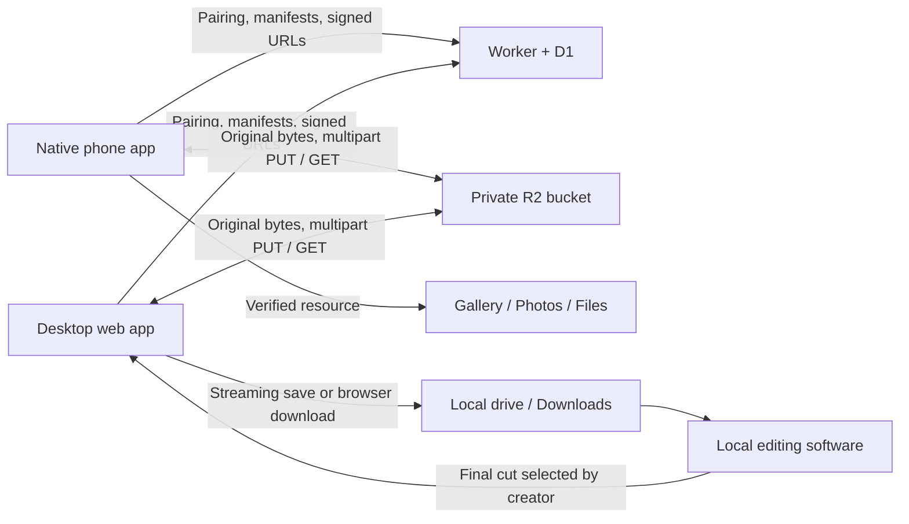

# Relay: original media, directly to local storage

## Product flow

One shared chronological drop zone has two filters: **Originals** and **Final cuts**. There are no approval states or mandatory project folders. The category describes a file; it does not restrict who can retrieve it.

| Screen | Primary action | Result |
| --- | --- | --- |
| First connection | Scan a desktop invitation QR or open its link; Connect | Stores a persistent HttpOnly browser session; native clients use secure OS storage. No account or password. |
| Originals | Drop originals; select files in the system picker | Immediately queues selected original files. No separate confirmation screen. |
| Original card | Save to device | Starts a verified native save, or browser download. |
| Final cuts | Drop final cuts; select locally edited files | Publishes completed files to every paired device after upload assembly. |
| Final card | Save to device | Saves locally through the same original-byte pipeline. |
| Interrupted transfer | Resume | Reselect the original after reload; reuse persisted upload parts. |

The two-action constraint applies to normal **in-app** actions after pairing and permissions. Selecting multiple files, operating an OS camera, choosing a save directory, and answering OS permission prompts cannot have an unconditional two-tap total. The app must accurately describe these exceptions instead of suppressing required system consent.

## Stack and separation of responsibilities

- **Desktop:** React + TypeScript, with the existing Vinext/Vite server adapter on Cloudflare Workers.
- **Mobile:** Expo SDK 57 / React Native, with a local native Kotlin/Swift transfer module. JavaScript draws the interface; it does not own long-running transfers.
- **Metadata/API:** Cloudflare Worker + D1. Tables hold spaces, paired devices, one-use invitations, and media manifests.
- **Original bytes:** a private Cloudflare R2 bucket. Metadata calls authorize and sign transfer URLs. Clients send and receive file bytes directly to/from R2.
- **Recovery:** IndexedDB on desktop; SQLite manifests on Android; atomic file manifests on iOS. Credentials use HttpOnly secure cookies, Android Keystore encryption, or iOS Keychain respectively.

## Integrity and reliability

1. Retain the selected resource in durable native staging. Compute SHA-256 incrementally without decoding the media.
2. Create an immutable media/upload manifest containing the filename, MIME type, byte count, category, hash, and stable UUID.
3. Upload 16 MiB parts directly through short-lived signed URLs. Persist each accepted part number and ETag. A retry gets a fresh URL and resends only unfinished parts.
4. Complete the multipart object and verify its byte count before publishing the feed entry. Server completion is idempotent.
5. Native downloads and supported desktop streaming saves compare both byte count and SHA-256 before reporting a verified local copy.

Preserving the entire byte sequence preserves embedded EXIF, encoded video, color profiles, and other embedded metadata. R2 does not guarantee integrity merely because a URL is signed: validation is a separate responsibility. The current server checks object size, not the whole-object SHA-256; the source and verified download clients perform hashing. Browser-managed downloads do not expose a completion/hash check to the app.

Keep previews separate from originals. The web client generates bounded JPEG thumbnails for supported small images, stored separately. Every Save action references the immutable original object. Never regenerate an original from a decoded bitmap, canvas, preview, or edited Photos representation.

## Local saving by platform

**Android:** Download to app-private staging, verify, then write through MediaStore with `IS_PENDING=1`. Use Pictures/Relay for images, Movies/Relay for video, and Download/Relay for other resources. Publish by clearing `IS_PENDING` only after the copy succeeds. Android 14+ uses user-initiated transfer jobs; the Android 10–13 fallback uses a foreground data-sync service and notification.

**iOS:** Background URLSession downloads to staging. Verify before `PHAssetCreationRequest.addResource` with a file URL; request add-only Photos permission. If permission is denied or the format is not importable, retain the verified original and offer a Files export sheet. PhotoKit grouping of Live Photo resource pairs and RAW companions requires additional native import/export work. The current Swift implementation still needs Mac compilation and real-device validation.

**Desktop web:** Call the supported save picker synchronously from the user's click, before waiting for a signed URL. Stream into the writable destination with incremental hashing; abort on mismatch. Where File System Access is unavailable, use a signed attachment download and let the browser manage Downloads. Browser permission policy controls whether a destination prompt appears. Do not load a multi-gigabyte file into a Blob to trigger saving.

## Pairing and scope

An existing device creates a short-lived, one-use invitation. The recipient redeems it for a long-lived device session; the server stores only the session's hash. Invitations are QR/link conveniences, not permanent bearer secrets. Paired access lasts one year in the current implementation and can be revoked from another connected device. Already-issued object URLs remain valid until their expiration.

## Release boundaries

The desktop app is deployed. Android has a locally installable preview; physical-device validation is recorded in [mobile/VALIDATION.md](../mobile/VALIDATION.md). The iOS implementation is source awaiting Mac validation. The web release includes cursor pagination, filename search, a 100 GiB quota including reservations/previews, Trash/restore, explicit permanent deletion, upload cancellation and restart. No completed original is deleted automatically. Dedicated native capture, original-resource selection, native cache cleanup, and app-store distribution remain separate work.

Web flows passed Chrome, Edge, Firefox, and Playwright WebKit at desktop and 390 px widths. Background tab suspension and direct Photos import remain browser boundaries. WebKit automation does not replace physical Safari/iOS validation.

References: [R2 presigned URLs](https://developers.cloudflare.com/r2/api/s3/presigned-urls/), [Android user-initiated transfers](https://developer.android.com/develop/background-work/background-tasks/uidt), [Apple background URLSession](https://developer.apple.com/documentation/foundation/downloading-files-in-the-background), [File System Access](https://developer.chrome.com/docs/capabilities/web-apis/file-system-access).
